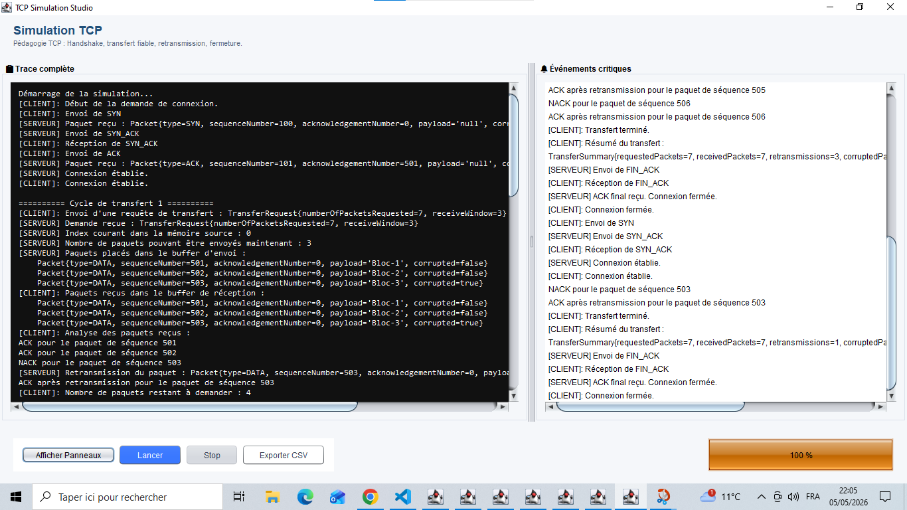
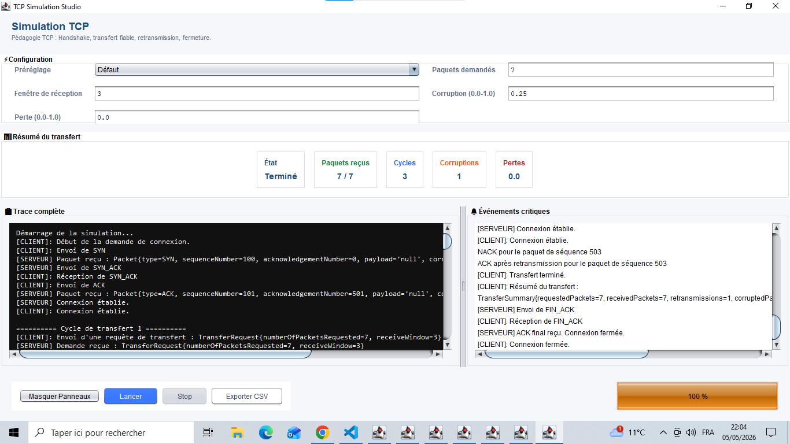
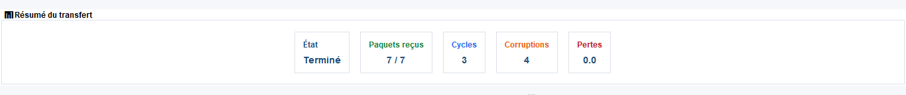
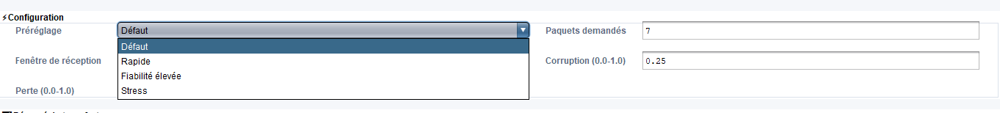
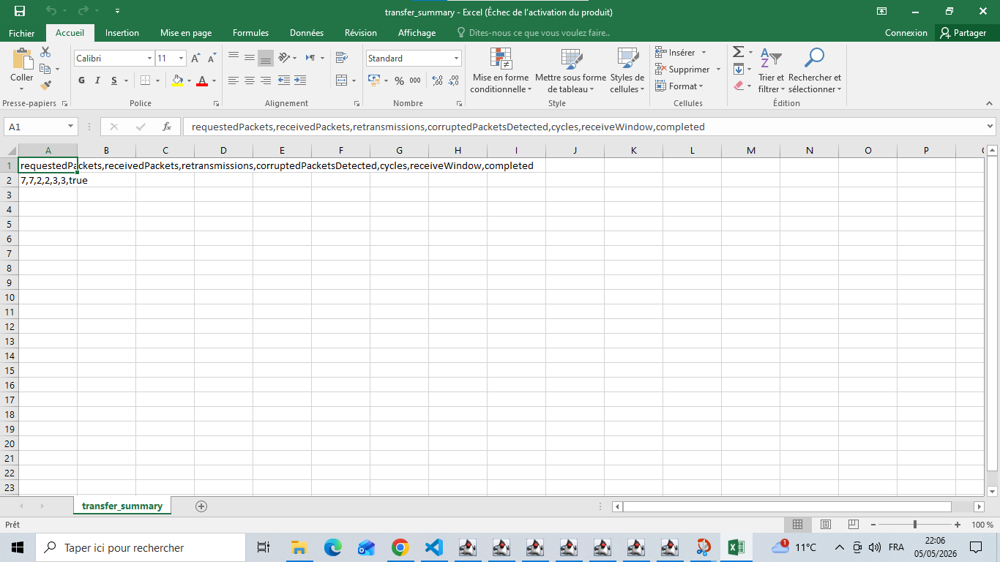

# Simulation du Protocole TCP

Projet Java (Maven) qui simule une connexion TCP client/serveur en mémoire, sans socket réseau réelle.

## Points clés

- Ouverture de connexion: `SYN` -> `SYN_ACK` -> `ACK`
- Transfert par paquets avec fenêtre glissante
- Détection de corruption (`NACK`) et retransmission
- Fermeture propre: `FIN` -> `FIN_ACK` -> `ACK`
- Résumé de transfert exportable en CSV
- Deux interfaces: CLI interactive et GUI Swing

## Prérequis

- Java 17+
- Maven 3.8+

## Démarrage rapide

```bash
mvn clean compile
java -cp target/classes fr.uvsq.tcpsim.Main 7 3
```

## Lancement des interfaces

CLI interactive:

```bash
java -cp target/classes fr.uvsq.tcpsim.cli.InteractiveCLI
```

GUI Swing:

```bash
java -cp target/classes fr.uvsq.tcpsim.gui.TcpGui
```

## Paramètres

`Main` accepte:

- `totalPacketsRequested`: nombre de paquets demandés
- `receiveWindow`: taille de fenêtre de réception

Exemple:

```bash
java -cp target/classes fr.uvsq.tcpsim.Main 5 2
```

## Configuration (`config.properties`)

Créer un fichier `config.properties` à la racine pour définir les valeurs par défaut:

```properties
corruptionProbability=0.25
lossProbability=0.0
defaultPackets=7
defaultWindow=3
exportPath=transfer_summary.csv
```

## Tests et qualité

Lancer les tests:

```bash
mvn test
```

Lancer Checkstyle:

```bash
mvn checkstyle:checkstyle
```

## Export CSV

Le résumé de transfert peut être exporté (CLI/GUI) vers `transfer_summary.csv`.

Colonnes CSV:

```text
requestedPackets,receivedPackets,retransmissions,corruptedPacketsDetected,cycles,receiveWindow,completed
```

## Captures d'écran

Interface principale:



Configuration + résumé:



Résumé du transfert:



Menu des préréglages:



Export CSV:



## Structure du projet

- `src/main/java/fr/uvsq/tcpsim/Main.java` : entrée principale
- `src/main/java/fr/uvsq/tcpsim/cli/InteractiveCLI.java` : CLI
- `src/main/java/fr/uvsq/tcpsim/gui/TcpGui.java` : GUI Swing
- `src/main/java/fr/uvsq/tcpsim/client/TcpClient.java` : logique client
- `src/main/java/fr/uvsq/tcpsim/server/TcpServer.java` : logique serveur
- `src/main/java/fr/uvsq/tcpsim/model/` : modèles de données
- `src/test/java/` : tests

## Notes

- Le dossier `target/` est généré par Maven.
- Les sorties locales (`transfer_summary.csv`, PDF local) sont ignorées par Git.